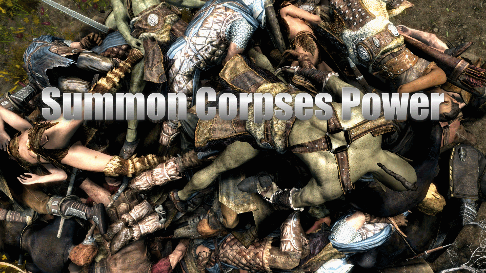

# Summon Corpses Power

A Skyrim Special Edition mod By Mark E. Kraus.

My mods:

* [Barstool Brawler](https://www.nexusmods.com/skyrimspecialedition/mods/61354)
* [Chairhammers - Chair Warhammers](https://www.nexusmods.com/skyrimspecialedition/mods/61304)
* [Chairrows - Chair Arrows](https://www.nexusmods.com/skyrimspecialedition/mods/61168)
* [Cheat Jewelry](https://www.nexusmods.com/skyrimspecialedition/mods/58973)
* [Cheat Powers](https://www.nexusmods.com/skyrimspecialedition/mods/58892)
* [Exit Combat Power](https://www.nexusmods.com/skyrimspecialedition/mods/58651)
* [Greatchairs - Chair Greatswords](https://www.nexusmods.com/skyrimspecialedition/mods/62526)
* [Sentient Chairs of Skyrim (SCOS)](https://www.nexusmods.com/skyrimspecialedition/mods/59604)
* [Summon Corpses](https://www.nexusmods.com/skyrimspecialedition/mods/62857)

## About Summon Corpses Power

Adds a power that summons a coffin once a day to dump 1 to 25 fresh corpses on the targeted area. The number of corpses is based on your Conjuration skill and can be configured in the Mod Configuration Menu.

You may be wondering why this mod exists. It was an idea I had while working on another silly mod. I made this only because I thought it was interesting. Maybe this is useful for a Necromancer play-through? I don't know; I didn't make it with any purpose in mind other than thinking it would be cool in a macabre sort of way.

## Features

### The Summon Corpses Power

The "Summon Corpses" power can be used once a day. It will summon a coffin above the targeted area and dump 1-25 corpses.

The power can be learned through a spell tome in the Whiterun Hall of the Dead Catacombs.

The corpses can be looted, reanimated, or just left for decoration.

The summoned corpses are not persistent so they will de-spawn like most hostile NPCs.

### Number of Corpses

The number corpses summoned scales with your Conjuration skill. The maximum number of corpses can be set in the Mod Configuration Menu. Consider toggling this down if you suffer performance issues with the default setting.

Max 1: Only 1 corpse will be spawned regardless of skill level.

Max 5:

* Skill level 1-29: 1 corpse
* Skill level 30-39: 2 corpses
* Skill level 40-49: 3 corpses
* Skill level 50-59: 4 corpses
* Skill level 60+: 5 corpses

Max 10:

* Skill level 1-19: 1 corpse
* Skill level 20-29: 2 corpses
* Skill level 30-39: 4 corpses
* Skill level 40-49: 6 corpses
* Skill level 50-59: 8 corpses
* Skill level 60+: 10 corpses

Max 15:

* Skill level 1-19: 1 corpse
* Skill level 20-29: 3 corpses
* Skill level 30-39: 5 corpses
* Skill level 40-49: 7 corpses
* Skill level 50-59: 10 corpses
* Skill level 60+: 15 corpses

Max 20:

* Skill level 1-19: 1 corpse
* Skill level 20-29: 5 corpses
* Skill level 30-39: 8 corpses
* Skill level 40-49: 10 corpses
* Skill level 50-59: 15 corpses
* Skill level 60+: 20 corpses

Max 25 (Default):

* Skill level 1-19: 1 corpse
* Skill level 20-29: 5 corpses
* Skill level 30-39: 10 corpses
* Skill level 40-49: 15 corpses
* Skill level 50-59: 20 corpses
* Skill level 60+: 25 corpses

### Types of Corpses

The types of corpses summoned are random but can be bandits, warlocks, Forsworn, Guards, Imperial soldiers, Stormcloak soldiers, Thalmor, and vampires.

The level of corpses scales with your player level.

## Installation

### Requirements

This mod requires [SkyUI](https://www.nexusmods.com/skyrimspecialedition/mods/12604) for the Mod Configuration Menu.

### NMM/Vortex/MO2

Download and install with Vortex and the FOMOD installer will take care of the rest.

### Manual

* Extract the 7z file using 7-Zip.
* Copy the extracted `MarkekrausSummonCorpses.esp` and `MarkekrausSummonCorpses.bsa` files to the `data` folder under your Skyrim: Special Edition installation folder.
* Enable the plugin using whatever method you usually use.

### Load Order

This mod can be installed in any order.

## User Guide

Enter the Whiterun Hall of the Dead Catacombs and read the "Spell Tome: Summon Corpses" book. Equip the power in your Magick menu. Aim at the location you wish to have corpses dumped. Activate the power. Wait 1 in-game day to use the power again.

You can change the maximum number of corpses and scaling with Conjuration in the Mod Configuration menu.

## Compatibility

This mod should be compatible with everything. Any mod that significantly modifies the Hall of the Dead Catacombs in Whiterun may make the spell tome inaccessible.
